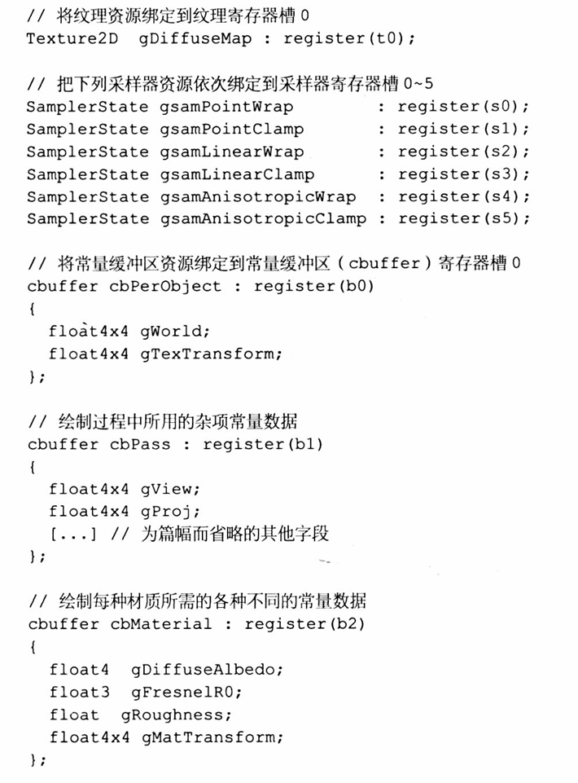

# DirectX12LearnProject
# DirectX12学习仓库

## 什么是顶点缓冲区，什么是顶点缓冲区视图？
顶点缓冲区是 GPU 内存中存储顶点数据的区域，包含了 3D 模型的所有几何信息（如位置、法线、纹理坐标等），由辅助描述结构体CD3DX12_RESOURCE_DESC所描述并由ID3D12Device::CreateCommittedResource函数所创建。
```cpp
//流程如下
// 1. 创建默认缓冲区资源（GPU可访问）
ComPtr<ID3D12Resource> vertexBuffer;//顶点缓冲区
device->CreateCommittedResource(
    &CD3DX12_HEAP_PROPERTIES(D3D12_HEAP_TYPE_DEFAULT),//在GPU端创建默认堆，存储静态数据提高效率
    D3D12_HEAP_FLAG_NONE,
    &CD3DX12_RESOURCE_DESC::Buffer(vertexBufferSize),//顶点尺寸以字节为基准
    D3D12_RESOURCE_STATE_COPY_DEST,
    nullptr,
    IID_PPV_ARGS(&vertexBuffer)
);

// 2. 创建上传缓冲区（CPU可写，用于初始化数据）
ComPtr<ID3D12Resource> vertexBufferUploadHeap;
    device->CreateCommittedResource(
    &CD3DX12_HEAP_PROPERTIES(D3D12_HEAP_TYPE_UPLOAD),//因为CPU无法直接操作GPU内存，所以将数据先存在CPU端的上传堆，让GPU自己去拿，符合硬件物理架构
    D3D12_HEAP_FLAG_NONE,
    &CD3DX12_RESOURCE_DESC::Buffer(vertexBufferSize),
    D3D12_RESOURCE_STATE_GENERIC_READ,
    nullptr,
    IID_PPV_ARGS(&vertexBufferUploadHeap)
);

// 3. 将顶点数据从CPU复制到上传缓冲区
Vertex vertices[] = { /* 顶点数据 */ };
D3D12_SUBRESOURCE_DATA vertexData = {};//用于描述需要复制到 GPU 资源（如缓冲区、纹理）中的CPU 端数据的布局和位置。
vertexData.pData = vertices;//数CPU 端数据起始地址的指针。
vertexData.RowPitch = vertexBufferSize;//数据行的字节大小，顶点数据一般是一维数据
vertexData.SlicePitch = vertexData.RowPitch;//SlicePitch 表示数据切片的字节大小，主要用于三维纹理或纹理数组。一个切片的字节数，类似于快递包裹的纵向高度。

// 4. 使用命令列表将数据从上传缓冲区复制到默认缓冲区
UpdateSubresources(commandList.Get(), vertexBuffer.Get(), 
    vertexBufferUploadHeap.Get(), 0, 0, 1, &vertexData);
```
顶点缓冲是一个轻量级描述符，告诉 GPU 如何解析顶点缓冲区中的数据。它不存储实际数据，而是定义数据的布局和位置,由结构体D3D12_VERTEX_BUFFER_VIEW定义。
```cpp
typedef struct D3D12_VERTEX_BUFFER_VIEW {
    D3D12_GPU_VIRTUAL_ADDRESS BufferLocation;  // 缓冲区GPU地址
    UINT                       SizeInBytes;     // 总大小（字节）
    UINT                       StrideInBytes;   // 每个顶点的字节步长
} D3D12_VERTEX_BUFFER_VIEW;
```
BufferLocation：顶点缓冲区的 GPU 虚拟地址（通过vertexBuffer->GetGPUVirtualAddress()获取）。
SizeInBytes：整个顶点缓冲区的大小（例如sizeof(vertices)）。
StrideInBytes：相邻两个顶点之间的字节偏移量（例如sizeof(Vertex)）。
```cpp
// 创建顶点视图
D3D12_VERTEX_BUFFER_VIEW vertexBufferView;
vertexBufferView.BufferLocation = vertexBuffer->GetGPUVirtualAddress();
vertexBufferView.StrideInBytes = sizeof(Vertex);
vertexBufferView.SizeInBytes = sizeof(vertices);

// 在命令列表中绑定顶点视图到输入装配器阶段,这样GPU才知道怎么用
commandList->IASetVertexBuffers(0, 1, &vertexBufferView);
```
## 什么是常量缓冲区，什么是常量缓冲区描述符？什么是根签名？（CBV）
常量缓冲区是一块GPU 内存，用于存储 shader 程序运行时不会改变的变量（如世界矩阵、视图矩阵、光照参数）。它是数据的实际存储位置，可被多个 shader（顶点着色器、像素着色器等）共享访问。
通常位于 GPU 显存（如 DirectX 的 D3D12_HEAP_TYPE_DEFAULT）或 CPU-GPU 共享内存（如 D3D12_HEAP_TYPE_UPLOAD）。DirectX12暂时看到是使用D3D12_HEAP_TYPE_UPLOAD创建的
```cpp
// 创建常量缓冲区（位于上传堆，支持CPU写入）
ComPtr<ID3D12Resource> constantBuffer;
device->CreateCommittedResource(
    &CD3DX12_HEAP_PROPERTIES(D3D12_HEAP_TYPE_UPLOAD),
    D3D12_HEAP_FLAG_NONE,
    &CD3DX12_RESOURCE_DESC::Buffer(1024),  // 1KB缓冲区
    D3D12_RESOURCE_STATE_GENERIC_READ,
    nullptr,
    IID_PPV_ARGS(&constantBuffer)
);

// CPU写入数据
void* dataBegin;
CD3DX12_RANGE readRange(0, 0);
constantBuffer->Map(0, &readRange, &dataBegin);//Map函数获取常量缓冲区的存储地址，好让CPU写入
memcpy(dataBegin, &myConstantData, sizeof(myConstantData));//将数据写入常量缓冲区
constantBuffer->Unmap(0, nullptr);//使用Unmap函数将数据提交，让GPU去读取
```
常量描述符是一个元数据对象，用于描述常量缓冲区的属性和位置，帮助 GPU 快速定位和访问常量缓冲区中的数据。它是常量缓冲区的 “指针”，不存储实际数据，而是指向存储数据的常量缓冲区。
```cpp
// 创建常量描述符堆
D3D12_DESCRIPTOR_HEAP_DESC heapDesc = {};//描述符堆描述结构体
heapDesc.NumDescriptors = 1;
heapDesc.Type = D3D12_DESCRIPTOR_HEAP_TYPE_CBV_SRV_UAV;  // 常量缓冲区描述符类型
heapDesc.Flags = D3D12_DESCRIPTOR_HEAP_FLAG_SHADER_VISIBLE;
device->CreateDescriptorHeap(&heapDesc, IID_PPV_ARGS(&descriptorHeap));

// 创建常量缓冲区视图（CBV，即常量描述符）
D3D12_CONSTANT_BUFFER_VIEW_DESC cbvDesc = {};
cbvDesc.BufferLocation = constantBuffer->GetGPUVirtualAddress();
cbvDesc.SizeInBytes = (sizeof(myConstantData) + 255) & ~255;  // 按256字节对齐，可以看看是什么原理
device->CreateConstantBufferView(&cbvDesc, descriptorHeap->GetCPUDescriptorHandleForHeapStart());
```
根签名到底是什么？其实就是将数据绑定到HLSL中的那些寄存器当中，以形成各式各样的函数着色器函数签名

```cpp
//创建流程如下

// 根参数数组
CD3DX12_ROOT_PARAMETER rootParameters[2];
    
// 参数0：常量缓冲区视图（CBV）
rootParameters[0].InitAsConstantBufferView(0);  // 寄存器b0
    
// 参数1：描述符表（包含多个SRV）
CD3DX12_DESCRIPTOR_RANGE descriptorRange;
descriptorRange.Init(D3D12_DESCRIPTOR_RANGE_TYPE_SRV, 1, 0);  // 1个SRV，寄存器t0
rootParameters[1].InitAsDescriptorTable(1, &descriptorRange);
    
// 静态采样器
CD3DX12_STATIC_SAMPLER_DESC staticSampler(
    0,  // 寄存器s0
    D3D12_FILTER_MIN_MAG_MIP_LINEAR
);
    
// 根签名描述
CD3DX12_ROOT_SIGNATURE_DESC rootSignatureDesc(
    _countof(rootParameters),
    rootParameters,
    1,
    &staticSampler,
    D3D12_ROOT_SIGNATURE_FLAG_ALLOW_INPUT_ASSEMBLER_INPUT_LAYOUT
);
    
// 编译根签名
ComPtr<ID3DBlob> signature;
ComPtr<ID3DBlob> error;
D3D12SerializeRootSignature(
    &rootSignatureDesc,
    D3D_ROOT_SIGNATURE_VERSION_1,
    &signature,
    &error
);
    
// 创建根签名对象
ComPtr<ID3D12RootSignature> rootSignature;
device->CreateRootSignature(
    0,
    signature->GetBufferPointer(),
    signature->GetBufferSize(),
    IID_PPV_ARGS(&rootSignature)
);
```

# 几种堆位于什么位置？
## D3D12_HEAP_TYPE_DEFAULT（默认堆）
内存位置：GPU 专用内存（通常是显卡的 VRAM）。
特点：
只能被 GPU 直接访问，CPU 无法直接读写（必须通过 “上传堆” 间接复制数据到这里）。
带宽最高，延迟最低，是性能敏感资源（如顶点缓冲区、纹理）的首选。
示例：如果你的顶点缓冲区是用 D3D12_HEAP_TYPE_DEFAULT 创建的，它就位于 GPU 内存中。
## D3D12_HEAP_TYPE_UPLOAD（上传堆）
内存位置：CPU 可访问的内存（通常是系统内存中被 GPU 映射的区域）。
特点：
CPU 可以直接读写（通过 Map() 映射后操作），GPU 也可以读取。
常用于临时数据传输（如动态更新的顶点数据），性能略低于默认堆。
示例：如果用上传堆创建缓冲区，它位于 CPU 可访问内存，但 GPU 可以通过总线读取。
## D3D12_HEAP_TYPE_READBACK（回读堆）
内存位置：CPU 可访问的内存（系统内存中 GPU 可写入的区域）。
特点：
主要用于 GPU 向 CPU 传输数据（如读取渲染结果），CPU 可读，GPU 可写。
性能较低，通常用于调试或离线数据处理。